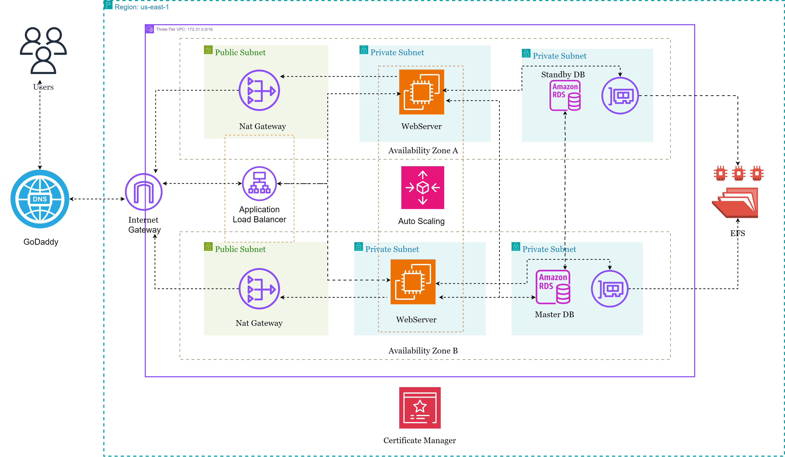

# Deploying WordPress on AWS Using a Three-Tier Architecture



## Introduction
Imagine a WordPress setup that’s scalable, secure, and resilient to traffic spikes! In this guide, we’ll deploy WordPress on AWS using a Three-Tier Architecture, dividing the setup into **Web**, **Application**, and **Database** layers for separation, security, and scalability.

## Building the Foundation: VPC and Subnet Creation
To start, we’ll create a Virtual Private Cloud (VPC) with a CIDR block of `172.31.0.0/16` in the EU-West-2 (London) region. We’ll also create six public and private subnets spread across multiple Availability Zones (AZs) for high availability:

- **Public Subnets**: Host resources requiring internet access (e.g., Application Load Balancer).
- **Private Subnets**: Secure EC2 instances and RDS database, isolated from direct internet access.

### Routing Setup:
1. **Public Route Table** with an Internet Gateway to enable internet traffic.
2. **Private Route Table** with a NAT Gateway for outbound internet access from private resources.

## Securing the Infrastructure: Security Groups
Security is key! We’ll create the following Security Groups:

- **EC2 Instance Connect Endpoint SG**: Allows SSH traffic on port 22 only within the VPC.
- **ALB SG**: Allows HTTP (port 80) and HTTPS (port 443) from anywhere.
- **Application Server SG**: Restricts HTTP/HTTPS traffic to the ALB and SSH traffic from the EC2 Instance Connect Endpoint.
- **RDS SG**: Allows MySQL connections on port 3306 only from Application Server SG.
- **EFS SG**: Enables NFS traffic from Application Servers.

## Setting Up EC2 Instance Connect
Using EC2 Instance Connect, we can SSH into our EC2 instances without SSH keys or a bastion host, keeping things simple and secure. 

1. Deploy an EC2 instance (Amazon Linux 2023) in a private subnet.
2. Test outbound internet access to ensure connectivity.

## The Data Tier: RDS Setup
In this step, we’ll set up **Amazon RDS** with MySQL:

- **Instance Type**: `db.t3.micro`.
- **Security**: Password authentication and the RDS SG for restricted access to the Application Servers.

## File Storage: EFS Setup
For scalable file storage, **Amazon Elastic File System (EFS)** will serve WordPress files across instances. 

### EFS Mount Script:
```bash
#!/bin/bash
# Mount EFS to /var/www/html
EFS_DNS_NAME=fs-0010eb9b6121b2db3.efs.eu-west-2.amazonaws.com
sudo mkdir -p /var/www/html
sudo mount -t nfs4 -o nfsvers=4.1,rsize=1048576,wsize=1048576,hard,timeo=600,retrans=2,noresvport "$EFS_DNS_NAME":/ /var/www/html
```

## Distributing Traffic: Application Load Balancer
Configure an **Application Load Balancer (ALB)** to route internet traffic to EC2 instances running WordPress.

- **Listeners**: HTTP and HTTPS for secure connections.
- **Target Group**: EC2 instances to receive traffic from the ALB.

## Deploying WordPress on EC2
We’re now ready to deploy WordPress. Launch an EC2 instance with **Apache**, **PHP**, and **MySQL** installed. Here’s the setup script:

```bash
#!/bin/bash
# Install Apache, PHP, MySQL client, and WordPress files
sudo yum update -y
sudo yum install -y httpd php mysql
sudo wget https://wordpress.org/latest.tar.gz
tar -xzf latest.tar.gz
sudo cp -r wordpress/* /var/www/html/
sudo systemctl start httpd
sudo systemctl enable httpd
```

Edit `wp-config.php` to connect WordPress to the RDS database.

## Scaling Up: Auto Scaling Group
To handle fluctuating traffic, we’ll create an **Auto Scaling Group** (ASG). Using a **Launch Template**, new instances automatically mount EFS and start necessary services. This setup ensures resilience and adaptability.

## Wrapping Up: SSL Configuration
For security, configure **SSL** with the following steps:

- Add an HTTPS listener to the ALB.
- Update `wp-config.php` to enforce SSL:

```php
/* SSL Settings */
define('FORCE_SSL_ADMIN', true);
if(isset($_SERVER['HTTP_X_FORWARDED_PROTO']) && $_SERVER['HTTP_X_FORWARDED_PROTO'] === 'https') {
  $_SERVER['HTTPS'] = '1';
}
```